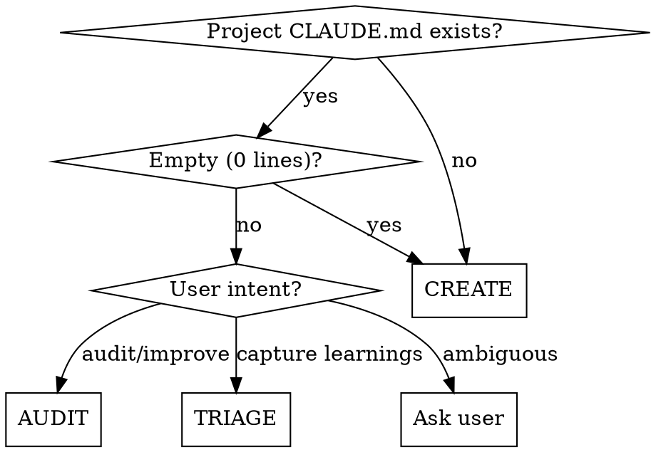

# CLAUDE.md

Create, audit, or triage CLAUDE.md files following best practices. Every line must earn its place.

## Pathway Detection

## Context Reading (All Pathways)

Before any pathway, read:

- `~/.claude/CLAUDE.md` — global preferences (read only, never write). Skip if absent.
- Project `CLAUDE.md` — if it exists
- Child `CLAUDE.md` files — in monorepos, read for awareness (all pathways operate on root only)
- `.claude/rules/*.md` — existing rules
- Project config files — package.json, pyproject.toml, composer.json, etc.

This informs deduplication. Never repeat what's already inherited.

## Core Principles

1. **200-line target, 300 max** — every line consumes context budget
2. **The removal test** — "If I remove this, will Claude make mistakes?" No → cut it.
3. **No noise** — no standard conventions, linter-enforced rules, obvious instructions, file-by-file descriptions
4. **Section order** — follow the structure template in `best-practices-reference.md` (project context → commands → directory structure → conventions → reference docs)
5. **Progressive disclosure** — reference detailed docs by plain path with a "Read when" trigger so Claude loads them on demand; `.claude/rules/` for team rules (note: `@imports` eager-load at session start — they are *not* lazy loading)
6. **Deduplication** — never repeat what's in `~/.claude/CLAUDE.md` or `.claude/rules/`
7. **IMPORTANT/YOU MUST** for critical rules to improve adherence

## CREATE Pathway

When no project CLAUDE.md exists (or existing one is empty):

1. **Analyze the project** — read config files, scan directory structure, check README, CI config, `.claude/rules/`, `~/.claude/CLAUDE.md`
2. **Identify what matters** — extract: project description, tech stack, essential commands, directory structure, non-obvious conventions, gotchas
3. **Filter against inherited context** — remove anything already in `~/.claude/CLAUDE.md` or `.claude/rules/`
4. **Apply the removal test** — consult `best-practices-reference.md` include/exclude checklists. Cut anything that fails.
5. **Draft using structure template** from `best-practices-reference.md`: project context → commands → directory structure → conventions → reference docs
6. **Present draft to user** — show proposed CLAUDE.md, explain what was included/excluded and why
7. **Write on approval** — create the file

## AUDIT Pathway

When CLAUDE.md exists and user wants to improve it:

1. **Read all context** — existing CLAUDE.md, `~/.claude/CLAUDE.md`, `.claude/rules/`, project config files
2. **Evaluate against best practices** — consult `best-practices-reference.md` for full evaluation criteria (line count, duplication, staleness, noise, structure, progressive disclosure)
3. **Apply the removal test** — for each line: "If removed, will Claude make mistakes?"
4. **Present findings** — what to remove, restructure, or add, with reasoning
5. **User approves changes** — apply only what user accepts
6. **Commit changes**

## TRIAGE Pathway

When the user wants to capture session learnings:

1. **Gather candidates** — review conversation for insights, corrections, conventions, gotchas, patterns
2. **Propose destinations** — consult `best-practices-reference.md` destination bias table. Bias toward memory/rules over CLAUDE.md. For each candidate, propose one of:
   - **CLAUDE.md** — only project-level gotchas that pass the removal test
   - **`.claude/rules/`** — team-wide coding rules (create directory if needed)
   - **Memory** — personal preferences, user context, external references → write to `~/.claude/projects/<project>/memory/` with standard frontmatter. If no memory system, fall back to `.claude/rules/` or suggest user note manually.
   - **Skip** — already covered or not worth persisting
3. **Present the full plan** — table of learnings with proposed destinations and reasoning
4. **User approves, adjusts, or skips** in one pass
5. **Write to confirmed destinations**
6. **Re-check CLAUDE.md line count** if modified — warn if over 200, suggest pruning
